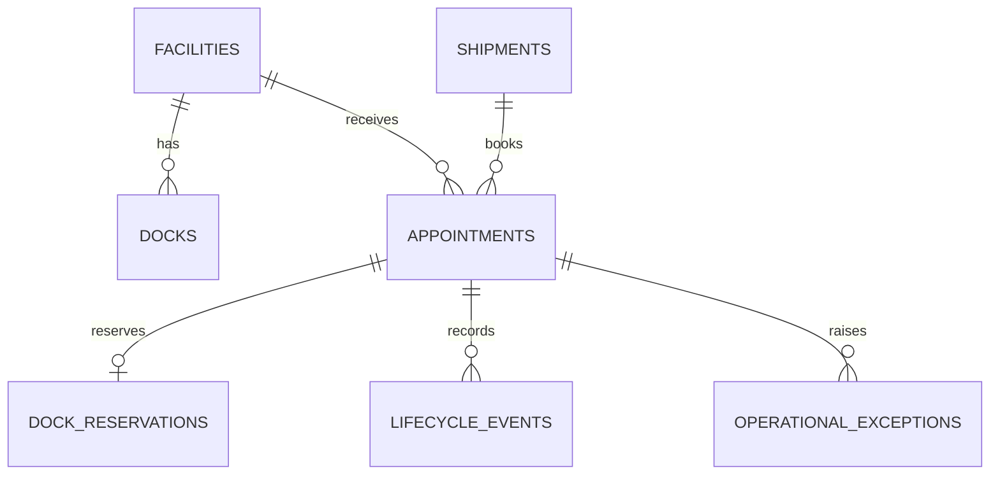

# ER diagram

```mermaid
erDiagram
  FACILITIES ||--o{ DOCKS : has
  FACILITIES ||--o{ APPOINTMENTS : receives
  SHIPMENTS ||--o{ APPOINTMENTS : books
  APPOINTMENTS ||--o| DOCK_RESERVATIONS : reserves
  APPOINTMENTS ||--o{ LIFECYCLE_EVENTS : records
  APPOINTMENTS ||--o{ OPERATIONAL_EXCEPTIONS : raises
```

